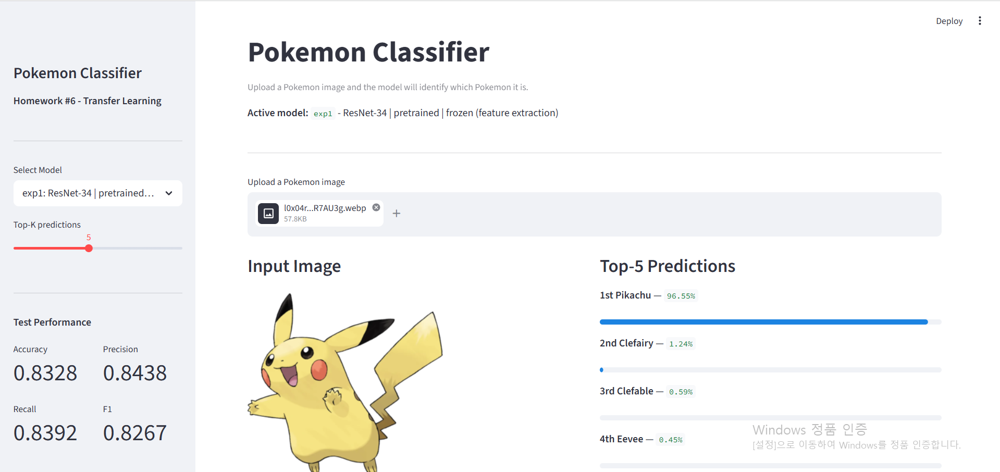
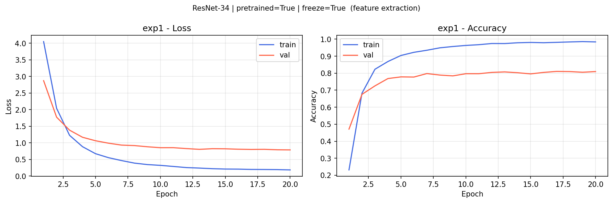
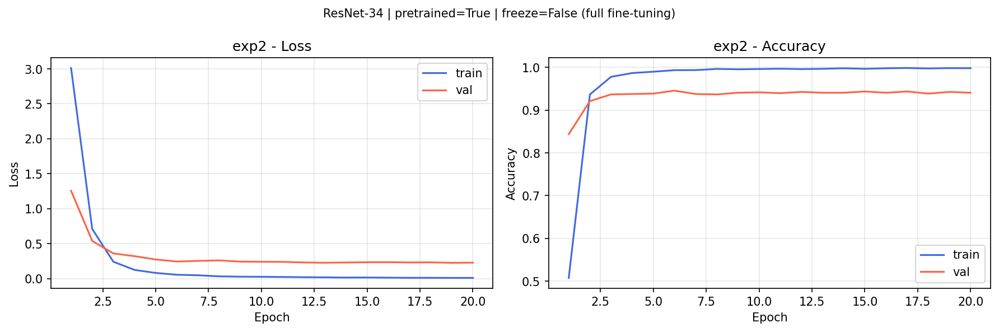
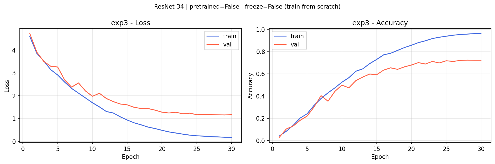
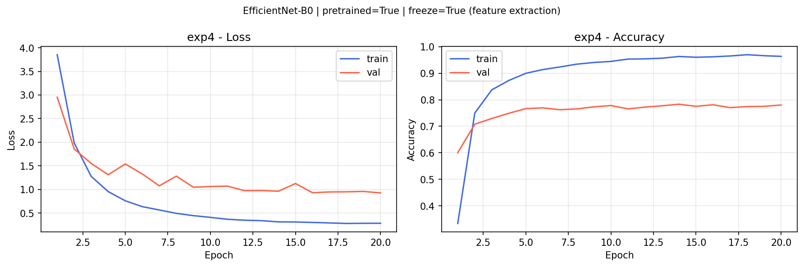
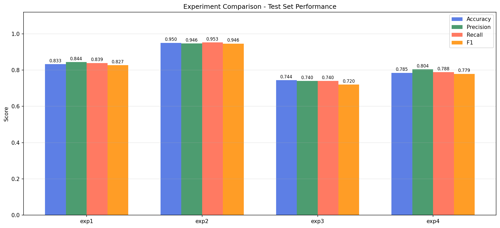

# You're Mine! – Pokemon Classifier

Pokemon image classification using CNN backbones and transfer learning.

**Dataset:** [7,000 Labeled Pokemon](https://www.kaggle.com/datasets/lantian773030/pokemonclassification) (150 classes, Kaggle)

## Demo



---

## Experiments

4 configurations comparing transfer learning strategies from lecture:

| Exp  | Backbone       | Pretrained | Backbone frozen | Strategy              |
|------|----------------|:----------:|:---------------:|-----------------------|
| exp1 | ResNet-34      | Yes        | Yes             | Feature extraction    |
| exp2 | ResNet-34      | Yes        | No              | Full fine-tuning      |
| exp3 | ResNet-34      | No         | No              | Train from scratch    |
| exp4 | EfficientNet-B0| Yes        | Yes             | Feature extraction    |

> **Transfer learning guideline (lecture):** Similar domain + small dataset → freeze backbone and train head only. Similar domain + large dataset → full fine-tuning with smaller LR.

---

## Results

| Exp  | Model          | Test Acc | Precision | Recall | F1   |
|------|----------------|----------|-----------|--------|------|
| exp1 | ResNet-34 frozen   | 0.8328 | 0.8438 | 0.8392 | 0.8267 |
| exp2 | ResNet-34 finetune | 0.9501 | 0.9462 | 0.9525 | 0.9457 |
| exp3 | ResNet-34 scratch  | 0.7439 | 0.7396 | 0.7399 | 0.7198 |
| exp4 | EfficientNet-B0    | 0.7849 | 0.8038 | 0.7880 | 0.7789 |


*Fill in after training.*

### Learning Curves

| exp1 | exp2 |
|------|------|
|  |  |

| exp3 | exp4 |
|------|------|
|  |  |

### Comparison Chart



---

## Setup

```bash
pip install -r requirements.txt
```

---

## Training

### Option A – kagglehub (자동 다운로드, 권장)

```bash
# 데이터셋을 자동으로 다운로드하고 바로 학습
python train.py --kagglehub --all

# 단일 실험만 실행
python train.py --kagglehub --exp exp1
```

> 첫 실행 시 Kaggle API 인증이 필요합니다 (`~/.kaggle/kaggle.json`).  
> kagglehub이 캐시 경로에 저장하므로 두 번째 실행부터는 즉시 시작됩니다.

### Option B – 수동 다운로드

```bash
# https://www.kaggle.com/datasets/lantian773030/pokemonclassification
# 에서 받아서 아래 구조로 압축 해제
# PokemonData/
#   Abra/  Aerodactyl/  Bulbasaur/  ...

python train.py --data_dir ./PokemonData --all
python train.py --data_dir ./PokemonData --exp exp1
python train.py --data_dir ./PokemonData --all --results_dir ./my_results
```

**Output per experiment:**
```
results/
  exp1/
    best_model.pth      # saved checkpoint (state_dict + class_names + backbone)
    metrics.json        # test acc / precision / recall / f1
    learning_curve.png  # train vs val loss & accuracy
  ...
  class_names.json      # list of 150 Pokemon names
  comparison.png        # bar chart comparing all 4 experiments
```

---

## Demo GUI

```bash
streamlit run app.py
```

Upload any Pokemon image and get top-K predictions with probabilities.

---

## Project Structure

```
You-re-mine-/
├── train.py          # Training script (4 experiments, metrics, plots)
├── app.py            # Streamlit demo GUI
├── requirements.txt
├── README.md
└── results/          # Auto-generated after training
```

---

## Key Design Decisions

- **Data split:** 70% train / 15% val / 15% test (fixed seed=42 for reproducibility)
- **Augmentation:** random crop, horizontal flip, color jitter (lecture: AlexNet/VGGNet style)
- **Optimizer:** Adam with cosine annealing LR schedule
- **Head replacement:** original FC-1000 replaced with FC-150 for all backbones
- **Checkpoint:** saves best val-acc model; loads it for final test evaluation
